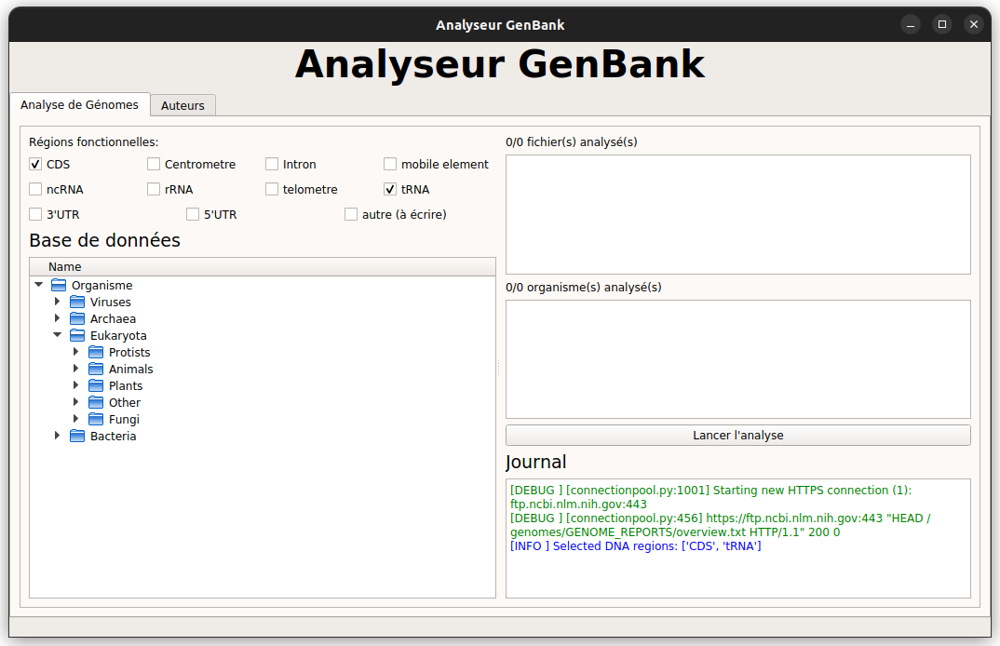
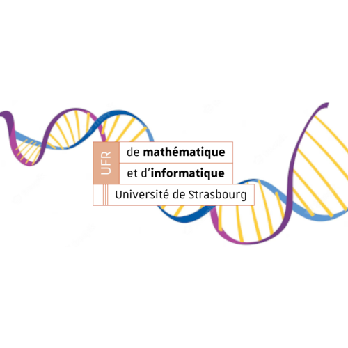

# Projet Algorithmes Du Texte : Acquisition des Régions Fonctionnelles dans les Génomes

## 🧬 Description
The GenBank sequence database is an open access, annotated collection of all publicly available nucleotide sequences and their protein translations. It is produced and maintained by the National Center for Biotechnology Information (NCBI; a part of the National Institutes of Health in the United States) as part of the International Nucleotide Sequence Database Collaboration (INSDC). [[Wikipedia](https://en.wikipedia.org/wiki/GenBank)]  

This program is a utility tool to facilitate access to this database. The user-friendly graphic interface allows to browse organisms in the database and parse their DNA. The DNA parsing can be set-up in order to parse only relevant DNA sequences such as: CDS, centromere, intron, mobile element, telomere, ncRNA, rRNA, tRNA, 3'UTR, 5'UTR.
## 🧬 Description

  

## 📂 Ressources

### 🔬 National Center for Biotechnology Information : National Library of Medicine
- [Présentation de GenBank](https://www.ncbi.nlm.nih.gov/genome/browse#!/overview/)
- [GenBank](https://ftp.ncbi.nlm.nih.gov/genomes/genbank/)
- [Recherche GenBank](https://www.ncbi.nlm.nih.gov/genome/)
- [GenBank: Homo sapiens Legacy Genome](https://www.ncbi.nlm.nih.gov/genome/?term=txid9606[orgn])

### 📚 Documentation
- [Biopython documentation](http://biopython.org/DIST/docs/tutorial/Tutorial.html#sec168)
- [Biopyhton GenBank](https://biopython.org/docs/1.76/api/Bio.GenBank.html)
- [Biopython examples](https://notebook.community/widdowquinn/Notebooks-Bioinformatics/Biopython_NCBI_Entrez_downloads)

## 🔧 Dependancies
- [Biopyhton](https://biopython.org/)
- [PyQt5](https://pypi.org/project/PyQt5/)

## 👥 Team
- ALLEMAND Fabien
- BONNAIL Julie
- COUTURE Louise
- LEBOT Samuel
- VLAYKOV Mathéo

  

## 📝 TO DO LIST !!!
- Julie & Louise:
    - [x] Arborescence interactive
    - [X] Arborescence par ordre alphabétique
    - [x] Checkbox pour les types de régions fonctionnelles
    - [X] Checkbox "Tout sélectionner"
    - [X] Checkbox par ordre alphabétique
    - [X] Checkbox Toutes/Aucune (afficher un seul message dans le journal)
    - [x] Journal
    - [x] Taille ajustable
    - [ ] Etat de l'analyse (x/y fichiers/organismes analysés)
    - [ ] Esthétique (taille du journal, couleur [application et journal], nom, onglet auteurs [file view sur README.md], logo dans la barre des tâches)
    - [ ] Documentation (code + README)

- Mathéo:
    - [ ] Tests
    - [x] Intégration Continue
    - [ ] Documentation (code + README)

- Samuel & Fabien:
    - [x] Analyse des fichiers
    - [ ] Multithreading
    - [x] Arborescence
    - [ ] Conservation de l'état de l'analyse
    - [ ] Documentation (code + README)
    - [ ] Sélectionner fichiers et résultats de test (comparer avec GenBank)